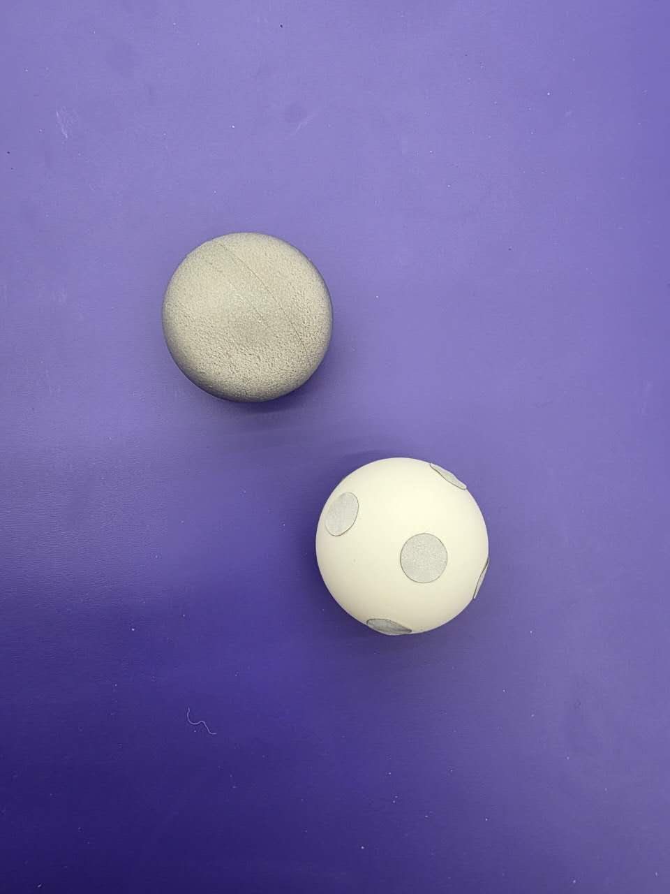

# HOPE 乒乓球竞技场动作捕捉系统参考设计

**v0.4** — 2026-06-17

> **存档参考文档。** 本文档早于当前的 HOPE 技术栈,保留用于场地搭建背景与技术沿革。
> 现行的坐标系与话题契约以 [`mocap/README.md`](README.md) 为准;仓库内实际使用的驱动为
> vendored 的 [`hope_ws/src/vrpn_mocap/`](../hope_ws/src/vrpn_mocap)。索引见
> [`REFERENCE_DOCS.md`](../REFERENCE_DOCS.md)。

---

## 1  兼容的动作捕捉系统

原始参考方案采用了 OptiTrack 系统。本参考设计文档构建了一套兼容多种主流动作捕捉系统的参考方案，重点覆盖 **OptiTrack**、**Vicon** 与 **青瞳视觉（CHINGMU）** 三大常用品牌，并预期可进一步兼容 `motion_capture_tracking` 库所支持的其他基于标记点（marker）的动捕品牌，包括 Qualisys、NOKOV、VRPN、FZMotion 以及 Motion Analysis。各品牌的相机硬件与厂商软件不尽相同——例如 OptiTrack 配合 Motive 与 NatNet 协议、Vicon 配合 Vicon Tracker、青瞳配合 CMTracker/CMAvatar 并支持 VRPN、TrackD、DTrack、OpenVR 及原生 LiveStream 等协议，且各家均提供 C/C++、Python、ROS 等 SDK——但本设计将它们统一到同一套 ROS 2 REP 103 坐标系与 `/poses` + `/tf` 话题接口之下。各系统将数据转换为 ROS 2 消息的具体流程见第 6 节（青瞳路径见第 6.5 节）。

具体而言，该原始方案安装了：

- OptiTrack **Motive v3.4**（相机管理与跟踪软件）
- **NatNet SDK v4.4**（用于通过网络传输跟踪数据的流式协议）
- **9 台 OptiTrack 相机**，以 **360 Hz** 运行，达到毫米级精度

对于 HOPE 参考设计，推荐的最低规格为：

- 至少 **6 台相机**（推荐 8–12 台），布置以覆盖整个球台体积，并在每位选手一侧留出 1.5 m 余量
- 相机帧率 **≥ 120 Hz**（在球速超过 5 m/s 的竞技性球体跟踪中，推荐 240–360 Hz）
- 在跟踪体积内达到亚毫米级的重建精度

---

## 2  环境标记点与坐标系的设置

为避免标定误差及平台潜在移动，最直接的做法是将动捕系统原点直接锚定在乒乓球台（PPT，Ping-Pong Table）上。然而，一个常见的混淆点在于：OptiTrack 的默认坐标系（Y 轴向上）与 ROS 2（Z 轴向上，REP 103）以及 Vicon（Z 轴向上）均不相同。**在本参考设计中，我们采用 ROS 2 REP 103 约定作为标准世界坐标系。**

### 2.1  标准世界坐标系（ROS 2 REP 103）

世界坐标系原点设置在 **球台台面近端左角**（从选手一 P1 的视角看）：

| 轴 | 方向 | 在台面上的范围 |
|------|-----------|------------------------|
| **X** | 向前——沿球台长度方向朝向选手二（P2） | 0 → +2.74 m |
| **Y** | 向左——沿球台宽度方向，从 P1 视角 | 0 → −1.525 m |
| **Z** | 向上——竖直方向 | 0 = 台面 |

该约定与配套文档《HOPE 7DOF 球拍基于模型的规划器参考设计》中所使用的坐标系**完全一致**，从而确保所有球体轨迹预测、球拍目标计算以及 ROS 2 话题消息共享同一套一致的坐标系。

该坐标系中的关键地标：

| 地标 | X (m) | Y (m) | Z (m) |
|----------|-------|-------|-------|
| 原点（P1 近端左角） | 0.0 | 0.0 | 0.0 |
| 球网中心线 | 1.37 | −0.7625 | 0.0 |
| P1 半场中心 | 0.685 | −0.7625 | 0.0 |
| P2 半场中心 | 2.055 | −0.7625 | 0.0 |
| 原点正下方地面 | 0.0 | 0.0 | −0.76 |
| 虚拟击球平面（规划器） | x = x_hit ≈ 0.0 | — | — |

台面占据区域为：`x ∈ [0, 2.74]`、`y ∈ [−1.525, 0]`、`z = 0`。

### 2.2  修正 OptiTrack 的默认坐标系

OptiTrack Motive 默认采用 **Y 轴向上** 的坐标系，这与 ROS 2 的 Z 轴向上约定不兼容。修正方法：

1. 在 Motive 中，导航至 **Edit → Settings → Streaming**（或打开 Data Streaming 面板）。
2. 在 **Advanced Network Options** 下，将 **Up Axis** 由 “Y Axis” 改为 **“Z Axis”**。
3. 调整标定地面（ground plane）的朝向，使标定方块（calibration square）的长边对齐期望的 X 轴方向（朝向 P2）。这在标定杆（wand）流程中设定了世界坐标系的朝向。

Vicon Tracker 默认为 Z 轴向上，通常无需进行轴向修正。但应在地面标定过程中确认 X 轴沿球台长度方向指向 P2。

对于 **青瞳（Chingmu）CMTracker**，世界坐标系由地面标定步骤中 L 型架/标定方块的摆放位置确定，而向上轴（up axis）可在流式/导出设置中配置。请将向上轴设为 **Z**，使流式数据匹配 ROS 2 REP 103 约定，并摆放标定方块使其长边沿球台长度方向指向 P2。若某一特定的 CMTracker 安装版本只能以 Y 轴向上或其他非 REP-103 坐标系进行流式传输，**请勿**尝试围绕该坐标系重新标定——而应在第 6.5.3 节所述的 ROS 2 桥接节点中应用固定的轴向转换。

### 2.3  球台刚体定义（PPT）

将反光标记点或回射贴片（至少 10 mm × 10 mm）贴附在 PPT 的**外框**上。这些标记点共同构成一个刚体，在 Motive（或 Vicon Tracker）中定义为资产 **“PPT”**。

放置要求：

- 在球台框架外缘以**非对称**配置贴附**至少 4 个标记点**。
- 将标记点放置在大多数相机位置可见、且在比赛过程中不会被选手、球网或球体遮挡之处。
- **不要将标记点放置在击球台面上**——它们会干扰球体的弹跳动力学，并可能与球体标记点混淆。

PPT 刚体的枢轴点（pivot point）必须设置在 **台面近端左角**（即原点），并使刚体局部坐标系与上文定义的世界坐标轴对齐。标定完成后，当球台静止且对齐正确时，PPT 刚体应报告单位位姿（位置 ≈ [0, 0, 0]，姿态 ≈ [0, 0, 0, 1]）。

PPT 刚体具有两个用途：

1. **原点锚定**——为所有其他被跟踪物体定义世界坐标系原点。
2. **球台移动检测**——若球台在比赛中被碰撞或移位，PPT 位姿将偏离单位位姿，从而允许规划器进行补偿或标记需要重新标定。

---

## 3  被跟踪物体分类

动作捕捉系统恰好跟踪**三类**物体。球拍（paddle）明确**不在**其列。

### 3.1  球拍排除策略——球拍不由动作捕捉系统跟踪

**动作捕捉系统不得跟踪乒乓球拍（paddle）。** 不应在球拍上放置或贴附任何反光标记点或跟踪资产。这是一项与 HOPE 竞赛设计相一致的、刻意的架构性决策：

**理由：**

1. **正运动学推断。** 人形机器人必须依据自身的本体感受状态（关节编码器读数加上被跟踪的 `base_link` 位置），通过其手臂运动链的正运动学来推断球拍的 6 自由度位姿（位置与姿态）。这考验机器人内部身体模型的精度，而这是任何现实世界操作任务的核心能力。

2. **末端执行器无外部传感。** 在本架构中，全身控制器（WBC）从规划器接收期望的球拍状态 `(p_intercept, v_racket, n_racket, t_strike)`，并使用其 RL 策略驱动 7 自由度手臂达到该状态。控制器从不接收来自动捕系统的实测球拍位姿。球拍的实际位置是机器人关节构型的涌现属性，而非外部测量量。

3. **竞赛公平性。** 外部跟踪球拍会提供绕过机器人控制挑战的闭环反馈。HOPE 竞赛要求每支队伍的人形机器人通过自身的运动学模型来展示自主的球拍控制。

4. **实际可靠性。** 在快速挥动的球拍上（手臂速度超过 3 m/s），标记点会遭受严重遮挡、运动模糊及离心脱落。将球拍排除在跟踪之外消除了一个脆弱的传感环节。

**执行：** 在竞赛布置过程中，裁判将核实球拍、机器人手部，以及超出机器人躯干/骨盆上最后一个被跟踪刚体标记点的腕部连杆上，均无回射材料。

**交叉引用：** 配套文档《HOPE 7DOF 球拍基于模型的规划器参考设计》（第 0.1 节）记录了规划器在无任何球拍位姿反馈的情况下输出期望球拍状态。配套文档《HOPE WBC 仿真训练参考设计》（第 2.8 节——球拍安装运动学）记录了从 `base_link` 经 7 自由度手臂到 3D 打印固定球拍支架的完整正运动学（FK）链，包括确保仿真模型与物理支架匹配的 `T_mount` 标定流程。

### 3.2  被跟踪物体汇总

| 物体 ID | 资产类型 | 跟踪对象 | 标记点 | 跟踪模式 |
|-----------|-----------|-----------------|---------|---------------|
| **PPT** | 刚体（厂商跟踪） | 乒乓球台框架 | 球台外框上 ≥ 4 个非对称 | 厂商 6 自由度 |
| **P1、P2、……** | 刚体（厂商跟踪） | 人形机器人 `base_link` | 躯干/骨盆板上 ≥ 4 个非对称 | 厂商 6 自由度 |
| **Ball（球）** | 单一未标记标记点 | 乒乓球球心 | 球上 1 个回射标记点或贴带 | 帧间点跟踪 |

比赛过程中，跟踪体积内不应有其他物体携带回射标记点。游离标记点会引起错误关联并破坏球体跟踪。

---

## 4  人形机器人 base_link 标记点的设置

在本参考设计中，人形机器人通过**从 `base_link` 出发**经手臂运动链的正运动学来推断球拍的 6 自由度位姿。因此，动捕系统为每台机器人提供的唯一空间锚点即为其 `base_link` 位置。

### 4.1  base_link 约定——一般原则

对于人形机器人的 `base_link` 应定义在何处，并不存在普遍标准。该约定因制造商、URDF 编写选择以及机器人预期的控制架构而异。然而，业界出现了三种常见模式：

**模式 A——骨盆根（双足运动最常见）。** `base_link` 即骨盆连杆，位于髋部板中心，腿部运动链由此向下分支、躯干链由此向上分支。这是 RL 训练运动控制器的标准，因为骨盆在行走中是最稳定的参考——它是全身动力学中的浮动基坐标系。Unitree G1、Unitree H1、Boston Dynamics Atlas、Agility Digit，以及大多数在 Isaac Lab 或 MuJoCo 中训练的人形机器人均采用此模式。

**模式 B——躯干/胸部根。** 一些平台将 `base_link` 置于上躯干或胸部，即腰关节之上。这在双足运动中较不常见（骨盆动力学更稳定），但可能出现在以操作为主的配置中——此时手臂是主要关注点，而腿部被视为移动底盘子系统。

**模式 C——腰关节根。** 一种折中方案，`base_link` 位于腰关节本身——即腿部与躯干的交界处。在许多简单设计中，这与骨盆原点共位（模式 A）。在具有多自由度腰部关节的机器人中，腰关节位于骨盆之上，将其选作 `base_link` 会将根置于两个子系统之间。

**对于 HOPE 竞赛，关键要求是：**

> `base_link` 必须是到达持拍手的正运动学链的根。规划器在世界坐标系中输出期望球拍状态；机器人的 WBC 必须计算从 `base_link` 到球拍的手臂关节轨迹以实现该状态。

这意味着完整的 FK 链为：`world → base_link（来自动捕）→ 腰关节 → 肩 → 肘 → 腕 → 拍尖（来自关节编码器）`。`base_link` 与球拍之间的每个关节都必须配备编码器，且其读数可供机器人控制软件使用。

### 4.2  Unitree G1

Unitree G1 是 HOPE 的主要参考平台。

| 属性 | 取值 |
|----------|-------|
| `base_link` 位置 | **骨盆**——腰部下躯干中心，大致位于两条髋偏航（hip yaw）关节轴的交点处 |
| 模式 | A（骨盆根） |
| 站立时骨盆高度 | 离地约 0.78 m（在 HOPE 坐标系中 z ≈ +0.02 m） |
| 机器人总高 | 1.27–1.32 m |
| 重量 | 含电池约 35 kg |
| 总自由度 | 23（基础版）至 43（带灵巧手的 EDU 版） |
| 手臂自由度 | 每臂 7 |
| 腰部自由度 | 1（偏航） |
| URDF 来源 | `github.com/unitreerobotics/unitree_ros` → `robots/g1_description` |
| 中间件 | 原生支持 ROS 2 |

运动学树由骨盆分支：

```
pelvis (base_link)
├── left_hip_yaw_joint  → 左腿 (6 DOF)
├── right_hip_yaw_joint → 右腿 (6 DOF)
└── waist_yaw_joint     → 躯干 → 肩 → 肘 → 腕 (每臂 7 DOF)
```

**标记点放置：** 在固定于骨盆外壳的刚性板上贴附 4 标记点非对称簇。在 Motive 中将刚体枢轴点设置为骨盆原点（髋部板中心）。若标记点位于外壳表面，则标定一个数厘米的 Z 向静态 TF 偏移。

### 4.3  Agibot 远征 A3（Expedition A3）

远征 A3 是智元（Agibot）的新一代运动型人形机器人，曾演示空中功夫动作。截至 2026 年 3 月，其处于量产前阶段，计划于 2026 年晚些时候量产。

| 属性 | 取值 |
|----------|-------|
| `base_link` 位置 | **待确认**——可能为骨盆（模式 A），但其柔性腰部或许更适合模式 C |
| 站立高度 | 全尺寸（约 1.75 m，据视频估计） |
| 重量 | 未公开披露 |
| 总自由度 | 未公开披露；描述为“高度拟人的全身自由度” |
| 手臂自由度 | 未公开披露（据 Agibot 平台谱系预期每臂 7 自由度） |
| 腰部自由度 | **多自由度柔性腰**——一项关键的区别性特征，专为镜像人体活动范围而设计，可实现复杂全身动作所需的旋转与摆动 |
| URDF 来源 | 截至 2026 年 3 月未公开 |
| 中间件 | **AimRT**（Agibot 原生 C++20 运行时）；支持 ROS 2 协议桥接 |

**关键考量：**

1. **柔性腰部的影响。** A3 的多自由度柔性腰专为乒乓球所需的躯干旋转与重心转移而设计。然而，若腰部具有 2–3 个自由度（俯仰、横滚、偏航），则 `base_link` 相对于腰关节的位置选择会显著影响 FK 链长度。对于乒乓球，腰部自由度直接贡献于球拍定位（腰部旋转扩展了手臂的有效触及范围与角度），因此 `base_link` 理想情况下应位于腰部**之下**（模式 A），以将腰部自由度纳入球拍 FK 链中。

2. **量产前状态。** 计划使用 A3 参加 HOPE 的队伍应直接与 Agibot 协调，以获取 URDF 并确认 `base_link` 约定、`base_link` 高度，以及从 `base_link` 到持拍手的完整关节链。开源的 Agibot X1 训练仓库（`github.com/AgibotTech/agibot_x1_train`）在 `resources/robots/` 下包含 URDF 文件，可作为 Agibot 运动学树约定的参考。

3. **中间件桥接。** A3 原生运行于 AimRT 而非 ROS 2。AimRT 支持将 ROS 2 作为其多种通信协议之一（另有 HTTP、gRPC、MQTT 与 Zenoh）。对于 HOPE 架构，有两种集成方式：
   - **方式 1（推荐）：** 将 HOPE 规划器作为 ROS 2 节点运行；把 `RacketCommand` 话题桥接到 AimRT，由 A3 的原生 WBC 消费。来自动捕的 `base_link` 位姿仍然经 ROS 2 → AimRT 流动。
   - **方式 2：** 直接在 AimRT 内运行规划器，通过 AimRT 的 ROS 2 协议支持订阅动捕数据。

### 4.4  竞赛报名要求

每支队伍必须在 HOPE 竞赛报名时声明以下信息。这些信息用于核实动捕系统、规划器与 WBC 是否已针对其特定的人形机器人平台正确集成。

| 项目 | 描述 | 示例（Unitree G1） |
|------|-------------|---------------------|
| **机器人型号** | 制造商与型号标识 | Unitree G1 EDU |
| **`base_link` URDF 连杆名** | URDF 中对应 `base_link` 的确切连杆名 | `pelvis` |
| **`base_link` 物理位置** | 描述该连杆原点在物理机器人上的位置 | 髋部板中心，位于髋偏航轴交点 |
| **`base_link` 模式** | 采用哪种约定（第 4.1 节的 A/B/C） | 模式 A（骨盆根） |
| **站立时 `base_link` 高度** | 标称姿态站立时 `base_link` 原点离地高度 | 0.78 m（HOPE 坐标系中 z ≈ +0.02 m） |
| **动捕到 URDF 静态偏移** | 从动捕标记点簇质心到 URDF `base_link` 原点的平移 [dx, dy, dz] | [0.0, 0.0, −0.03] m（标记点位于外壳，比骨盆原点高 3 cm） |
| **手臂自由度数** | 从 `base_link` 到拍柄的驱动关节数，含腰部 | 1 腰 + 7 臂 = 8 自由度 |
| **中间件** | ROS 2 原生、带 ROS 2 桥接的 AimRT，或其他 | ROS 2 原生 |
| **URDF 可获取性** | 公开 URL 或“在 NDA 下提供给组织方” | `github.com/unitreerobotics/unitree_ros` |

动捕到 URDF 的静态偏移在队伍的启动（launch）文件中以 `static_transform_publisher` 发布：

```python
Node(
    package='tf2_ros',
    executable='static_transform_publisher',
    arguments=[
        '--x', '0.0', '--y', '0.0', '--z', '-0.03',
        '--roll', '0', '--pitch', '0', '--yaw', '0',
        '--frame-id', 'P1_mocap',
        '--child-frame-id', 'P1_base_link'
    ],
)
```

### 4.5  机器人已知信息 vs. 动捕提供信息

| 信息 | 来源 | 使用方 |
|-------------|--------|---------|
| 360 Hz 的球体位置 [x, y, z] | 动捕 → ROS 2 话题 | 规划器（阶段 1–3） |
| 人形机器人 `base_link` 6 自由度位姿 | 动捕 → ROS 2 话题 | WBC（阶段 4）用于基座位置指令 |
| 球台框架（PPT）位姿 | 动捕 → ROS 2 话题 | 规划器（原点参考/漂移检测） |
| 球拍 6 自由度位姿 | 由关节编码器 + `base_link` 经**正运动学** | WBC 内部状态；**非**来自动捕 |
| 球拍期望状态 | 规划器输出（阶段 3） | WBC（阶段 4）作为跟踪目标 |

---

## 5  球体跟踪配置

乒乓球作为**单一未标记标记点**进行跟踪——即一个对动捕系统可见、但不与任何刚体定义关联的单一回射点。

### 5.1  球体准备

- 在球上贴附一个 **6–9 mm 回射标记点**，或用回射贴带包裹球体。
- 标记点必须足够小，以免显著改变球体质量（2.7 g）或空气动力学特性。
- 每个球使用单个标记点。同一球上的多个标记点会在点云中造成歧义。

### 5.2  跟踪模式

在 `motion_capture_tracking` 中，球体使用 `librigidbodytracker` 的帧间点跟踪模式进行跟踪。其原理是在相邻帧之间对未标记点云标记点进行最近邻关联。与刚体跟踪（需 ≥ 3 个标记点以获得 6 自由度）不同，该模式跟踪单个点，仅提供 3 自由度位置 `[x, y, z]`。

`motion_capture_tracking` `cfg.yaml` 中的配置：

```yaml
type: "optitrack"           # 或 "optitrack_closed_source"、"vicon" 等
hostname: "MOTIVE_PC_IP"

robot_types:
  ball:
    motion_capture:
      tracking: "librigidbodytracker"   # 帧间单标记点
      initial_position: [1.37, -0.7625, 0.2]  # 近似初始位置
      dynamics:
        max_velocity: 10.0     # m/s，关联的上界
```

### 5.3  球体旋转（未来扩展）

在当前参考设计中，球体旋转被忽略。球体作为单个点进行跟踪，仅含位置 `[x, y, z]`。HOPE 规划器的空气动力学模型采用平移阻力，但不建模马格努斯力（旋转引起的升力）。

未来扩展可研究：球上更精细的标记点图案（例如以已知几何图案分布的多个小贴片）是否能实现旋转估计。这将需要升级为球体的刚体跟踪（≥ 3 个标记点），并将姿态四元数解析为角速度。此类扩展超出当前参考设计的范围。

### 5.4  球体反光处理方式与预期跟踪性能

实践中常见两种回射球体处理方式。在本参考设计的单标记点跟踪策略下，二者表现差异显著。



**左——整体回射涂覆的球体。** 整个表面均为回射材料（即第 5.1 节的“用回射贴带包裹球体”方案）。每台相机看到单个明亮的反光团块，其质心投影到球体的几何中心，因此球体重建为**位于真实球心的单一 3 自由度点**。这正是单标记点帧间跟踪器（第 5.2 节）所期望的。

**右——贴有多个回射贴片的白色球体。** 表面贴附了若干离散贴片。每个相机可见的贴片都重建为**各自独立**的未标记点，因此单个球体会向点云中注入多个同时存在的标记点——这正是第 5.1 节明确警示的歧义。

在当前（单标记点）策略下的预期性能：

| 评价指标 | 整体涂覆球（左） | 多贴片球（右） |
|-----------|--------------------------|--------------------------|
| 每个球产生的点数 | 1（单一团块） | 多个（每个可见贴片一个） |
| 报告的位置 | 真实球**心** | 某个**表面贴片**，偏离球心约一个半径（≈20 mm） |
| 旋转的影响 | **与旋转无关**——质心始终在球心 | 随贴片出现/遮挡，被跟踪点在各贴片间跳变；表观位置跳变最高可达一个球径 |
| 帧间关联 | 稳健（单一无歧义点） | 脆弱；当球速超过约 5 m/s 时，最近邻会匹配到错误贴片而失效 |
| 与第 5.2 节跟踪器的兼容性 | ✅ 直接兼容 | ❌ 违反单标记点假设 |
| 适用的跟踪模式 | 单一未标记标记点（当前设计） | 刚体/星座（constellation）跟踪，≥3 个标记点（第 5.3 节，超出范围） |

**结论。** 推荐 HOPE 采用整体涂覆球：它给出单一、与旋转无关、且球心精确的点，本参考设计可对其进行可靠跟踪。多贴片球在当前单标记点流程下**无法**被可靠跟踪——它需要第 5.3 节的刚体旋转估计扩展，而该扩展对于一个小、快、旋转的球体而言十分脆弱（无法保证每帧都有 ≥3 个几何已知且共同可见的贴片），且超出当前范围。

---

## 6  向 ROS 2 流式传输数据

OptiTrack 与 Vicon 均不直接以 ROS 2 消息格式发布跟踪数据。需在 ROS 2 Linux 主机上运行一个**转换驱动**，将厂商协议转换为 ROS 2 话题。

### 6.1  网络架构

```
┌─────────────────────────┐       NatNet (UDP)       ┌────────────────────────────────────┐
│   Windows PC             │  ─────────────────────▶  │   Linux PC (ROS 2 Jazzy)            │
│                          │    多播/单播              │                                     │
│   OptiTrack Motive 3.4   │    同一 LAN 子网         │   motion_capture_tracking            │
│   (相机、解算、           │                          │   (NatNet 解析 →                     │
│    刚体)                 │                          │    /poses、/tf、点云)                │
│                          │                          │                                     │
│                          │                          │   HOPE 规划器（阶段 1–3）            │
│                          │                          │   WBC（阶段 4）                      │
└─────────────────────────┘                           └────────────────────────────────────┘
            同一 LAN 交换机
```

两台机器必须处于同一子网。Motive 以相机帧率（例如 360 Hz）广播 NatNet 帧，而 Linux 侧的 `motion_capture_tracking` 对其进行解析并发布标准 ROS 2 消息。无需特殊桥接或 VPN——纯 UDP 网络即可。

相同架构同样适用于 Vicon：将 Motive 替换为 Vicon Tracker，并在 `motion_capture_tracking` 配置中设置 `type: "vicon"`。ROS 2 话题接口保持不变。

对于使用 AimRT 的机器人（例如 Agibot 远征 A3），可利用 AimRT 内置的 ROS 2 协议支持，将 `RacketCommand` 与 `base_link` 位姿话题从 ROS 2 桥接到 AimRT（参见第 4.3 节）。

青瞳（Chingmu）系统遵循相同的物理拓扑——一台运行 CMTracker 的 Windows PC 解算相机并通过 LAN 流式传输到 Linux ROS 2 主机——但使用不同的传输协议（VRPN / LiveStream 而非 NatNet）。将该数据流转换为下文 ROS 2 话题的方法详见第 6.5 节。

### 6.2  推荐的 ROS 2 驱动

`mocap4ros2_optitrack`（MOCAP4ROS2 项目）是常见的仅支持 OptiTrack 的驱动。然而，对于本参考设计，该软件包存在以下限制：

- 仅支持 OptiTrack（不兼容 Vicon）。
- **不**执行坐标系转换（按原样透传 NatNet 数据）。
- 不支持用于球体的单标记点跟踪。
- 其依赖的闭源 NatNet SDK 仅限 x86-64 Linux。

**对于 HOPE 参考设计，我们推荐 `motion_capture_tracking`**（IMRCLab）：

- 仓库：https://github.com/IMRCLab/motion_capture_tracking
- 通过统一接口支持 **OptiTrack、Vicon、Qualisys、VRPN、NOKOV、FZMotion 与 Motion Analysis**。
- 提供 `librigidbodytracker` 用于**单一未标记标记点跟踪**（乒乓球）。
- 已通过 apt 为 **ROS 2 Humble**（Ubuntu 22.04）与 **ROS 2 Jazzy**（Ubuntu 24.04）发布：
  ```bash
  sudo apt install ros-jazzy-motion-capture-tracking
  ```
- 通过 **tf2** 与可配置 QoS 的 `/poses` 话题发布。

### 6.3  Motive 流式设置检查表

在从 Motive 向 ROS 2 主机流式传输之前，请在 Data Streaming 面板中核实以下设置：

| 设置 | 所需取值 | 备注 |
|---------|---------------|-------|
| 启用 NatNet | ✅ 启用 | 必须开启方可流式传输 |
| 传输类型 | 多播（或单播） | 为控制带宽优先选用单播 |
| Up Axis | **Z 轴** | 关键——与 ROS 2 Z 轴向上约定对齐 |
| Labeled Markers | 关 | 不需要；可减小数据包体积 |
| Unlabeled Markers | **开** | 球体跟踪所需 |
| Marker Sets | 关 | 不需要 |
| Rigid Bodies | **开** | PPT 与人形机器人 base_link 所需 |
| Skeletons | 关 | 不需要 |
| Command Port | 1510（默认） | |
| Data Port | 1511（默认） | |

### 6.4  预期的 ROS 2 话题

配置完成后，可获得以下 ROS 2 话题：

| 话题 | 消息类型 | 内容 | 频率 |
|-------|-------------|---------|------|
| `/poses` | `geometry_msgs/PoseArray` | 所有被跟踪刚体及自定义跟踪标记点 | 360 Hz |
| `/tf` | `tf2_msgs/TFMessage` | 变换树：world → PPT、world → P1、world → P2、world → Ball | 360 Hz |

规划器从 `/poses` 或 `/tf` 订阅球体位置，并按规划器文档所述产生 `RacketCommand` 消息。WBC 同时订阅 `RacketCommand` 与来自 `/tf` 的人形机器人 `base_link` 变换。

### 6.5  将青瞳（Chingmu）动作捕捉数据转换为 ROS 2

青瞳服务器通过 **VRPN** 进行流式传输，可在同一连接上承载 HOPE 全部三类被跟踪物体——但它对这三类采用**两种不同的寻址方式**，而这一差异决定了应选用哪个 ROS 2 客户端：

| 被跟踪物体 | 读取的内容 | VRPN 寻址方式 |
|----------------|---------------------------|---------------------|
| **PPT**（球台） | 6 自由度位姿（位置 + 姿态） | 拥有**自己的 VRPN 发送方名称（sender name）**（如 `PPT`） |
| **P1、P2**（`base_link`） | 6 自由度位姿（位置 + 姿态） | 各自拥有**自己的 VRPN 发送方名称** |
| **Ball**（球） | 3 自由度位置 `[x, y, z]`；姿态为单位四元数，忽略 | 是某个共享发送方下的**一个 marker = 传感器 ID（sensor ID）**（没有自己专属的发送方名称） |

青瞳确认：每个刚体（PPT、P1、P2）都可被分配一个独立的 VRPN **发送方名称**；但球体是 **marker（标记点）** 而非刚体，因此它以**传感器 ID** 的形式传输，没有自己专属的发送方名称。**无需**单独的点云 SDK——所有数据都在这一条 VRPN 连接上——但 ROS 2 客户端必须能够解析**传感器 ID**，而不仅仅是发送方名称。

> **客户端选择。** 使用 **`vrpn_mocap`** 并设置 `multi_sensor: true`：它会为每个传感器 ID 发布一个话题，从而同时暴露具名刚体与球体 marker。**请勿**在此使用 `motion_capture_tracking` 的 VRPN 后端（libmotioncapture）——它仅按发送方名称索引 tracker、丢弃传感器 ID，因此无法区分出球体 marker。青瞳自有的 `ChingMuVrpnRos` 能正确解析该数据流，但面向 ROS 1；此处仅作验证参考，不用于 HOPE 的 ROS 2 技术栈。

### 6.5.1  ROS 2 VRPN 客户端——`vrpn_mocap`

在 ROS 2 Jazzy 主机上，运行原生 ROS 2 VRPN 客户端 `vrpn_mocap`，将其指向青瞳服务器（运行 CMTracker / `MCServer` 的 PC），并设置 `multi_sensor: true`，使每个 marker 的传感器 ID 各得一个话题：

```bash
ros2 launch vrpn_mocap client.launch.yaml server:=CHINGMU_SERVER_IP port:=3883
```

配合参数文件：

```yaml
/vrpn_mocap_client:
  ros__parameters:
    server: "CHINGMU_SERVER_IP"   # CMTracker / MCServer PC
    port: 3883                    # 青瞳 VRPN 端口
    frame_id: "world"
    multi_sensor: true            # 每个传感器 ID 一个话题——球体 marker 必需
    update_freq: 100.0
    refresh_freq: 1.0
```

`vrpn_mocap` 会发现每一个 VRPN 发送方，为每个发送方发布一个 `geometry_msgs/PoseStamped`；当 `multi_sensor: true` 时，再为每个传感器索引各发布一个，统一位于 `/vrpn_mocap` 命名空间下：

```
/vrpn_mocap/<sender>/pose_id_<sensor_id>      geometry_msgs/PoseStamped
```

请在 CMTracker 中为 **PPT**、**P1**、**P2** 分配并记录固定的 VRPN **发送方名称**，以便规划器与 WBC 订阅正确的话题。每个刚体都是单传感器发送方，因此显示为 `pose_id_0`，携带完整的 `pose.position` + `pose.orientation`（即 6 自由度测量）：

```
/vrpn_mocap/PPT/pose_id_0
/vrpn_mocap/P1/pose_id_0
/vrpn_mocap/P2/pose_id_0
```

增加一个小的 ROS 2 中继节点，将这些位姿合并到单一的 `/poses` `PoseArray` 中，并在 `/tf` 上（重新）广播 `world → PPT`、`world → P1`、`world → P2`，使其与第 6.4 节完全一致。

### 6.5.2  作为 3 自由度标记点的乒乓球

球体是 **marker（标记点）** 而非刚体，因此青瞳将其作为**某个共享 marker 发送方下的一个传感器 ID** 传输——它没有专属的发送方名称。当 `multi_sensor: true` 时（第 6.5.1 节），`vrpn_mocap` 会将其暴露为一个按传感器索引的话题：

```
/vrpn_mocap/<marker_sender>/pose_id_<ball_sensor_id>   geometry_msgs/PoseStamped
# pose.position 为有效的球体位置 [x, y, z]；pose.orientation 为单位四元数，忽略
```

请向青瞳确认该 marker 发送方名称及球体的传感器索引，并用 `ros2 topic list` 核实。球体必须是第 5 节所要求的**唯一**未标记 marker——游离 marker 会与之共用同一 marker 发送方，使传感器索引产生歧义。

对于规划器，订阅该话题并仅使用其位置字段即可。随仓库提供的 `hope_bringup` `pose_to_posearray` 节点正是这样做的：它把 tracker 话题聚合成共享的 `/poses` `PoseArray`，供规划器（以及标定录制工具 `hope_bag_to_csv`，配合 `ros2 bag record /poses`）直接消费。也可以用一个简单的中继将其重新发布为 `/ball/point` 上的 `geometry_msgs/PointStamped`：

```python
# ball_pose_to_point.py  （ROS 2，示意）
import rclpy
from rclpy.node import Node
from geometry_msgs.msg import PoseStamped, PointStamped

class BallRelay(Node):
    def __init__(self):
        super().__init__('ball_pose_to_point')
        self.pub = self.create_publisher(PointStamped, '/ball/point', 10)
        self.create_subscription(
            PoseStamped, '/vrpn_mocap/<marker_sender>/pose_id_<ball_sensor_id>', self.cb, 10)

    def cb(self, msg: PoseStamped):
        out = PointStamped()
        out.header = msg.header          # frame_id = 'world'
        out.point = msg.pose.position    # 丢弃姿态
        self.pub.publish(out)
```

若 CMTracker 无法直接以 HOPE 世界坐标系流式传输，请在该中继节点内（以及对刚体位姿）应用第 6.5.3 节的坐标转换后再重新发布。

### 6.5.3  转换到 HOPE 世界坐标系

所有青瞳输出都必须以第 2.1 节的标准 REP 103 Z 轴向上坐标系到达。首选方法是将 CMTracker 配置为以 **Z 轴向上** 流式传输，并使标定方块朝向 P2（第 2.2 节），此时无需软件旋转。若某一安装版本只能以右手系 **Y 轴向上** 坐标系流式传输，则在发布前于桥接节点中（或作为 `static_transform_publisher`）应用如下固定旋转：

```
# 右手系 Y 轴向上  →  REP 103 Z 轴向上
x_ros =  x_mocap
y_ros = -z_mocap
z_ros =  y_mocap
```

在信任任何转换之前，请凭经验核实源坐标系的手性：将一个标记点放置在已知的球台地标处（例如球网中心线 `x = 1.37, y = −0.7625`），并确认所发布的坐标与第 2.1 节的表格相符。若某一轴被镜像，则表明源坐标系为左手系，此时需要对相应分量取负，而非套用上述旋转。

### 6.5.4  CMTracker 流式设置检查表

| 设置 | 所需取值 | 备注 |
|---------|---------------|-------|
| VRPN 流式 | ✅ 启用 | 单一数据流同时承载刚体**与**标记点 |
| VRPN 端口 | 3883（默认） | 需与 ROS 2 客户端的 `port` 参数匹配 |
| ROS 2 客户端 | `vrpn_mocap`，`multi_sensor: true` | libmotioncapture 的 VRPN 后端不适用——它会丢弃传感器 ID |
| 刚体（PPT、P1、P2） | 各自一个独立的 VRPN **发送方名称** | 各自 → `/vrpn_mocap/<name>/pose_id_0`（6 自由度） |
| 球体 | 某共享发送方下的一个 **marker = 传感器 ID** | → `/vrpn_mocap/<marker_sender>/pose_id_<id>`（位置有效，姿态为单位四元数） |
| 仅单个 marker | 跟踪体积内无游离 marker | 多余 marker 会使球体的传感器索引产生歧义 |
| 向上轴（Up axis） | **Z** | 与 ROS 2 Z 轴向上对齐；否则按 6.5.3 转换 |
| 服务器 / Linux 主机子网 | 同一 LAN 子网 | 纯 UDP，如第 6.1 节 |

ROS 2 客户端运行后，`ros2 topic list` 会为每个物体显示一个 `/vrpn_mocap/<sender>/pose_id_<id>`（可按需中继为第 6.4 节的 `/poses` + `/tf` 及 `/ball/point`），且规划器与 WBC 无需任何厂商专属改动。

---

## 7  与 HOPE 规划器的集成

配套规划器文档（《HOPE 7DOF 球拍基于模型的规划器参考设计》）消费由 `motion_capture_tracking` 发布的球体位置数据，并产生球拍目标指令。整个系统的数据流为：

```
动作捕捉系统 (360 Hz)                                   人形机器人 (本体感受)
  │                                                      │
  ├── Ball [x,y,z]（单标记点）──▶ HOPE 规划器           │
  │                                  阶段 1–3            │
  ├── PPT 6 自由度 ──▶ 原点校验          │               │
  │                                       ▼               │
  └── P1 base_link 6 自由度 ─────────▶ WBC（阶段 4）◀── RacketCommand
                                          │              (p_intercept,
                                          │               v_racket,
                                          ▼               n_racket,
                                    关节指令               t_strike)
                                    （随平台而异）
                                          │
                                          ▼
                                    球拍位姿
                                    （由 base_link + 关节编码器
                                     经 FK 推断，
                                     非由动捕测量）
```

规划器完全在第 2.1 节定义的 HOPE 标准世界坐标系中运行。`motion_capture_tracking` 驱动所交付的位置已处于该坐标系中（前提是 Motive 的 Up Axis 设为 Z，且标定地面已与球台对齐）。

---

## 8  小结

HOPE 动作捕捉参考系统恰好跟踪三类物体：

1. **PPT**——乒乓球台，提供世界坐标系原点与漂移检测。
2. **P1、P2**——人形机器人 `base_link` 位姿，为每台机器人提供空间锚点。`base_link` 的定义随制造商而异（第 4 节）；每支队伍在报名时声明各自的定义。
3. **Ball**——作为单一未标记标记点的乒乓球，为规划器提供位置输入。

**球拍/球拍从不由动作捕捉系统跟踪。** 每台人形机器人必须通过关节编码器与被跟踪的 `base_link` 经正运动学来推断自身的球拍位姿。这是根本性的传感架构：外部感知（球体轨迹）馈入基于模型的规划器，而内部本体感受（关节状态 + `base_link`）驱动定位球拍的全身控制器。完整的从 `base_link` 经 7 自由度手臂到 3D 打印球拍支架的正运动学链，参见配套文档《HOPE WBC 仿真训练参考设计》（第 2.8 节）。

---

## 参考文献

- Su, Z., Zhang, B., Rahmanian, N., Gao, Y., Liao, Q., Regan, C., Sreenath, K., & Sastry, S. S. (2025). HITTER: A HumanoId Table TEnnis Robot via Hierarchical Planning and Learning. *arXiv:2508.21043v2*.
- HITTER 项目主页：https://humanoid-table-tennis.github.io/
- motion_capture_tracking：https://github.com/IMRCLab/motion_capture_tracking
- 青瞳视觉（CHINGMU）动作捕捉：https://www.chingmu.com/ （英文：https://en.chingmu.com/）——VRPN/LiveStream 流式传输，C/C++/C#/Python/ROS SDK
- ChingMuVrpnRos（青瞳官方 ROS VRPN 驱动；发布 6 自由度刚体与 3 自由度标记点）：https://github.com/ChingMuVisionTech/ChingMuVrpnRos
- vrpn_mocap（ROS 2 VRPN 客户端）：https://index.ros.org/p/vrpn_mocap/
- Agibot X1 训练代码（Agibot 运动学约定参考）：https://github.com/AgibotTech/agibot_x1_train
- 配套文档：《HOPE 7DOF 球拍基于模型的规划器参考设计，v0.1》
- 配套文档：《HOPE WBC 仿真训练参考设计，v0.5》
- 配套文档：《HOPE 硬件部署参考设计，v0.1》
